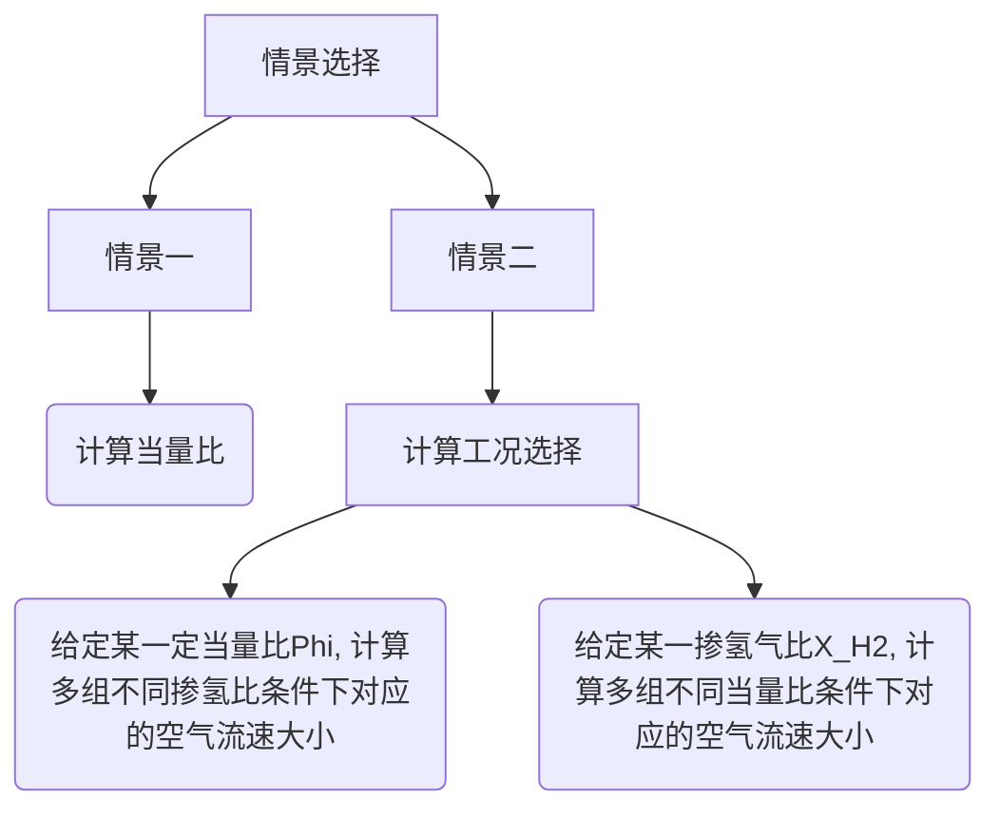

#  Purpose

本仓库用于简化工作量相关的Stuff。

# Content

```python
│  README.MD
│
├─codes
│      dir_to_crossplatform.py
│      equivalence_ratio_calculator.py
│      flow_rate.py
│      flow_rate.txt
│      rename_auto.py
│
├─dist
│      equivalence_ratio_calculator.exe
│
└─images
        表格.png
```

## Equivalence Ratio calculator

```
              =======================================
   air-inlet->|___->                                |
               ___|                                 |
  fuel-inlet->|___->       2-D Combustor            |
               ___|                                 |
   air-inlet->|   ->                                |
              =======================================
```



- 针对同轴燃烧器，燃料为甲烷
  - 计算当量比
  - 燃料流量固定的情况下：
    - 给定某一定当量比phi，计算**多组**、**不同**掺氢比条件下对应的空气流速大小；
    - 给定某一掺氢比x_h2，计算**多组**、**不同**当量比条件下对应的空气流速大小；

- 根据掺氢比与灶前总流量V一定，计算不同掺氢比条件下的甲烷与氢气这两支路流量，写入到txt文本，将文本用Excel文件加载，分割符选择**空格**，导入后，可批量复制计算结果。

## Scripts
- Equivalence ratio calculator
- 添加了文件重命名的Script`rename_auto.py` (适用于任意、已知、有限、特定格式)；

## Date

| SU   | MO  | TU  | WE  | TH  | FR  | SA   |
|------|-----|-----|-----|-----|-----|------|
|      |     |     |     | 1   | 2   | 3 🚩 |
| 4 🚩 | 5   | 6   | 7   | 8   | 9   | 10   |